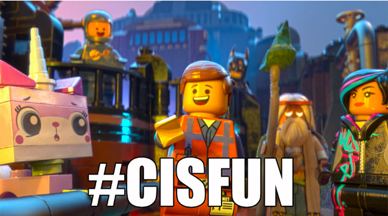

# 0x00 - C - Hello, World

 

## General

<ul>
<li>Why C programming is awesome (don’t forget to tweet today, with the hashtag #cisfun :))</li>
<li>Who invented C</li>
<li>Who are Dennis Ritchie, Brian Kernighan and Linus Torvalds</li>
<li>What happens when you type gcc main.c</li>
<li>What is an entry point</li>
<li>What is main</li>
<li>How to print text using printf, puts and putchar</li>
<li>How to get the size of a specific type using the unary operator sizeof</li>
<li>How to compile using gcc</li>
<li>What is the default program name when compiling with gcc</li>
<li>What is the official Holberton C coding style and how to check your code with betty-style</li>
<li>How to find the right header to include in your source code when using a standard library function</li>
<li>How does the main function influence the return value of the program</li>
</ul>

